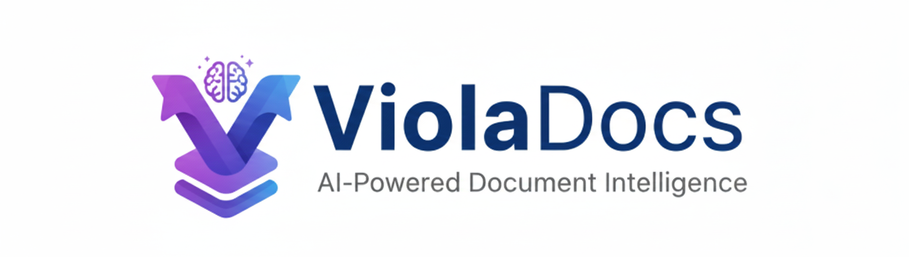
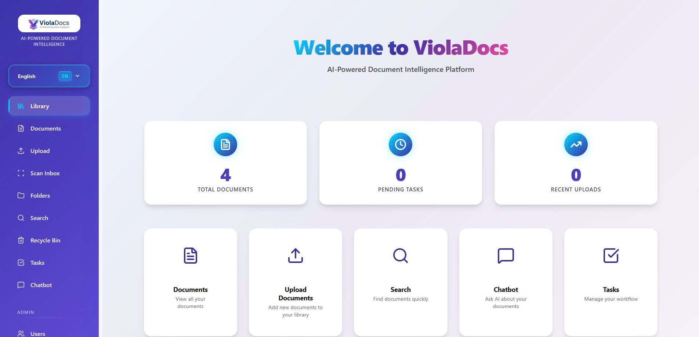

<div align="center">



# ViolaDocs - Document Management System

**AI-Powered Document Intelligence**

[](docs/showcase.html)

**[🎨 View Interactive Showcase →](docs/showcase.html)**

</div>

## 🚀 Transform Your Document Workflow

**ViolaDocs** is a next-generation AI-powered Document Management System that revolutionizes how organizations handle, search, and interact with their documents. Combining cutting-edge OCR technology, semantic search, and intelligent AI assistance, ViolaDocs transforms paper documents and digital files into searchable, intelligent knowledge assets.

### Why ViolaDocs?

✨ **Intelligent Document Processing** - Automatically extract text from images and PDFs using advanced OCR technology supporting multiple languages  
🔍 **Semantic Search** - Find documents by meaning, not just keywords, using hybrid vector and keyword search  
🤖 **AI-Powered Assistant** - Get instant answers from your document library with our RAG-powered chatbot  
📋 **Workflow Automation** - Streamline review and approval processes with built-in workflow management  
🔒 **Enterprise Security** - Role-based access control, comprehensive audit logging, and enterprise-grade security  
📱 **Device Integration** - Direct integration with printers and scanners for seamless document capture  
📊 **Advanced Analytics** - Comprehensive reporting and analytics to track document usage and workflows

## 🎯 Key Features

### Core Capabilities

- **📄 Document Management**: Upload, version control, search, and organize documents with intuitive folder structures
- **👁️ OCR Processing**: Advanced PaddleOCR support for English, Vietnamese, Japanese, Korean, and Chinese with high accuracy
- **🔎 Semantic Search**: Hybrid keyword + vector search that understands context and meaning
- **💬 AI Chatbot**: RAG-powered assistant with document group scoping for intelligent Q&A
- **⚙️ Workflow Management**: Review and approval workflows with customizable task assignments
- **👥 User Management**: Role-based access control (Admin/Staff/User) with granular permissions
- **🖨️ Device Integration**: Printer/scanner connector for direct scanning and document capture
- **📈 Audit & Reports**: Comprehensive logging, reporting, and analytics dashboard

### See It In Action

Check out our [interactive showcase](docs/showcase.html) to see ViolaDocs features in action with screenshots and demonstrations.

## About This Project

This project serves as a **practice implementation** demonstrating modern development workflows using **Cursor AI** for code generation and assistance. It showcases how AI-assisted development can accelerate the creation of complex enterprise applications, from architecture design to full-stack implementation.

**ViolaDocs** is part of the **AIAssis ecosystem**, a collection of projects exploring the integration of AI technologies in software development and business applications.

- **Document Management**: Upload, version control, search, and organize documents
- **OCR Processing**: PaddleOCR support for English, Vietnamese, Japanese, Korean, and Chinese
- **Semantic Search**: Hybrid keyword + vector search
- **AI Chatbot**: RAG-powered assistant with document group scoping
- **Workflow Management**: Review and approval workflows
- **User Management**: Role-based access control (Admin/Staff/User)
- **Device Integration**: Printer/scanner connector for direct scanning
- **Audit & Reports**: Comprehensive logging and reporting

## Tech Stack

### Backend
- FastAPI (Python)
- PostgreSQL with pgvector
- MinIO (S3-compatible object storage)
- Redis (caching and queues)
- PaddleOCR
- Gemini/OpenAI for LLM

### Frontend
- Vue 3 + Vite
- Pinia (state management)
- Vue Router
- Axios

## 🚀 Quick Start

For detailed setup instructions, see [SETUP.md](SETUP.md)

**Quick overview:**
1. Start infrastructure: `docker-compose up -d`
2. Setup backend: Configure `.env`, run migrations, start server
3. Setup frontend: Install dependencies, start dev server
4. Create admin user via API

See [SETUP.md](SETUP.md) for complete installation guide.

> 💡 **New to ViolaDocs?** Check out our [interactive showcase](docs/showcase.html) to explore features before installation.

## Project Structure

```
VanDMS/
├── docker-compose.yml          # Infrastructure services
├── docs/                       # Design documentation
│   ├── architecture/
│   ├── api/
│   ├── data/
│   ├── ui-ux/
│   └── extensibility/
├── src/
│   ├── backend/                # FastAPI backend
│   │   ├── src/app/
│   │   │   ├── main.py
│   │   │   ├── config.py
│   │   │   ├── models/         # SQLAlchemy models
│   │   │   ├── routers/        # API routes
│   │   │   ├── services/       # Business logic
│   │   │   └── workers/        # Background jobs
│   │   └── migrations/         # Alembic migrations
│   └── frontend/               # Vue 3 frontend
│       └── src/
│           ├── components/
│           ├── views/
│           ├── store/
│           └── services/
```

## Default Credentials

After first migration, create an admin user via API or database:

```python
# Example: Create admin user
POST /api/v1/users
{
  "name": "Admin",
  "email": "admin@example.com",
  "password": "admin123",
  "role": "admin"
}
```

## Development

### Running Tests
```bash
# Backend
cd src/backend
pytest

# Frontend
cd src/frontend
npm run test
```

### Database Migrations
```bash
cd src/backend
alembic revision --autogenerate -m "description"
alembic upgrade head
```

## AI-Assisted Development

This project was developed using **Cursor AI**, demonstrating:
- AI-powered code generation and refactoring
- Architecture design assistance
- Documentation generation
- Test case creation
- Bug fixing and optimization

The development process showcases how modern AI tools can enhance developer productivity while maintaining code quality and best practices.

## Ecosystem

Part of the **AIAssis** ecosystem - exploring AI integration in software development.

## License

Proprietary

